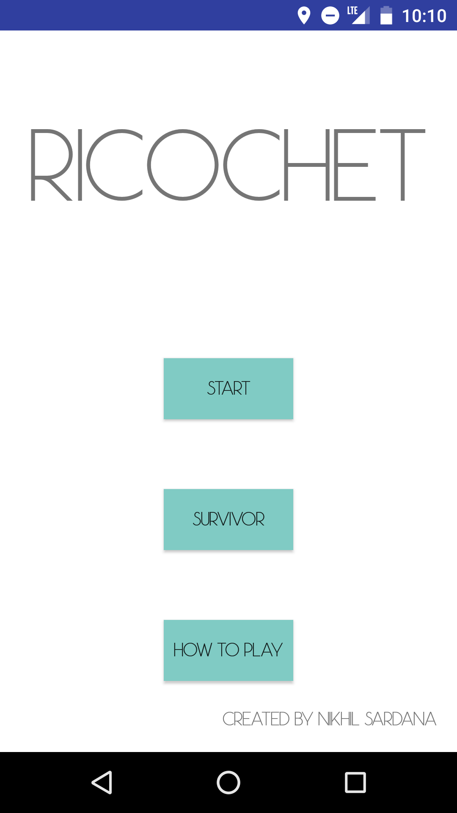
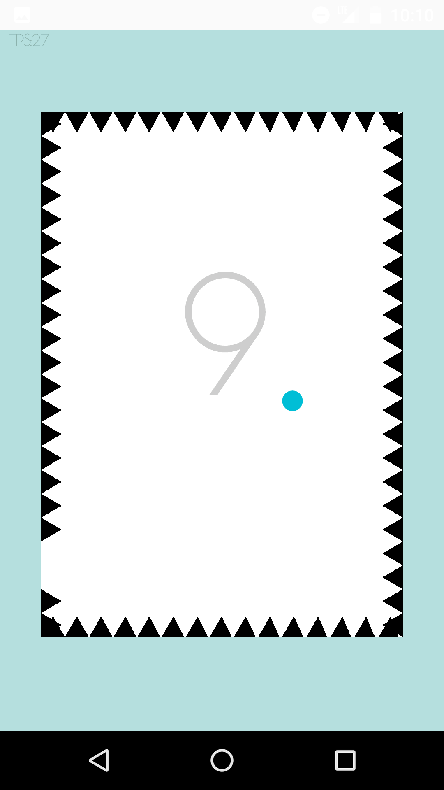
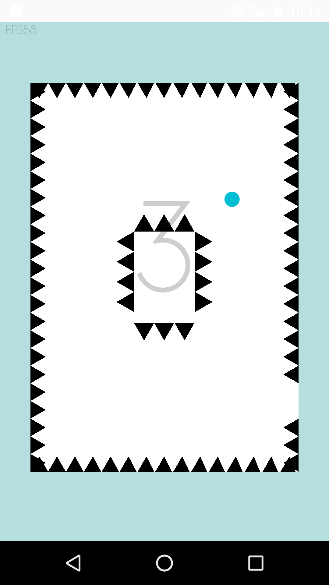
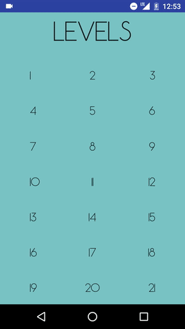

# Ricochet
A Minimalist Android Game

The game is simple! There's a ball in the middle of the screen, which you want to get to the edge (the blue part)

 
Don't touch the spikes! 
Swipe the screen to create lines so the ball "ricochets" off, changing directions.
 

